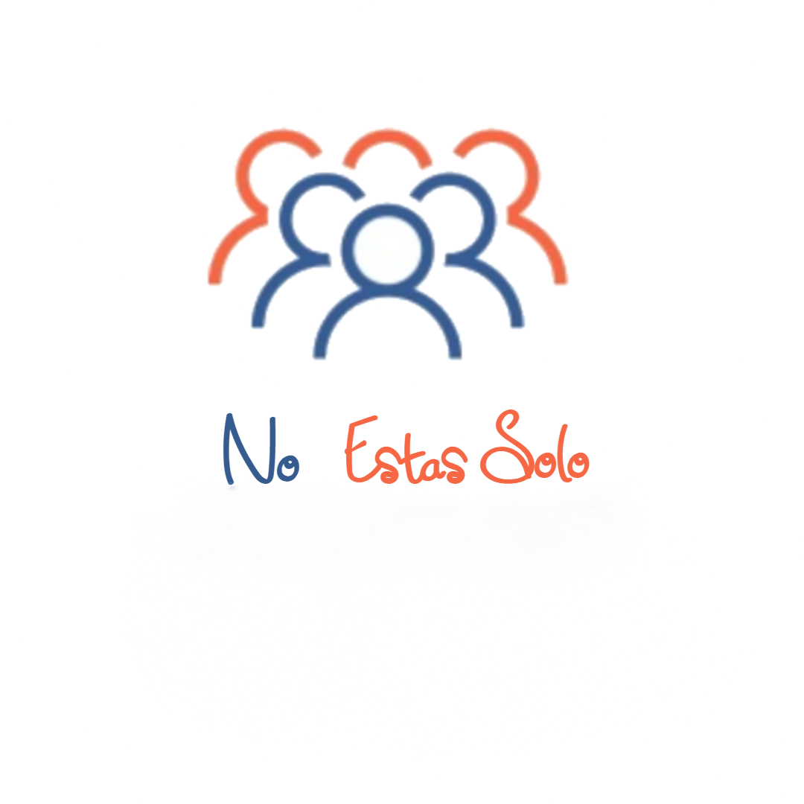

# NoEstasSolo

No Estas Solo es una organización sin fines de lucro que busca ayudar a personas de tercera edad brindandoles alimento y prendas de vertir.

## Acerca de Nosotros

El mensaje que busca entregar esta organización es que **No Estas Solo** y que con ayuda puedes salir adelante.

<center></center>

## Licencia

Si en la web o en cualquiera de los videos de esta organización sale tu rostro involuntariamente y te molesta, por favor avisar en el grupo de Facebook para remover el mismo.


## Para Desarrolladores

Si quieres contribuir en este proyecto debes tener estos conocimientos:

- HTML

- CSS

- JavaScript (Opcional)

Para aportar y contribuir al proyecto debes clonar este repositorio

Y una vez hechos los cambios pertinentes hacer un Pull Request a la rama Dev.

### Paleta de Colores

Estos son los tres colores que se usaran en este proyecto:

```CSS
 	/* Orange */
 	color: #f46444;
 	/* Blue */
 	color: #416190;
    /* White */
    color: #fff;

```

